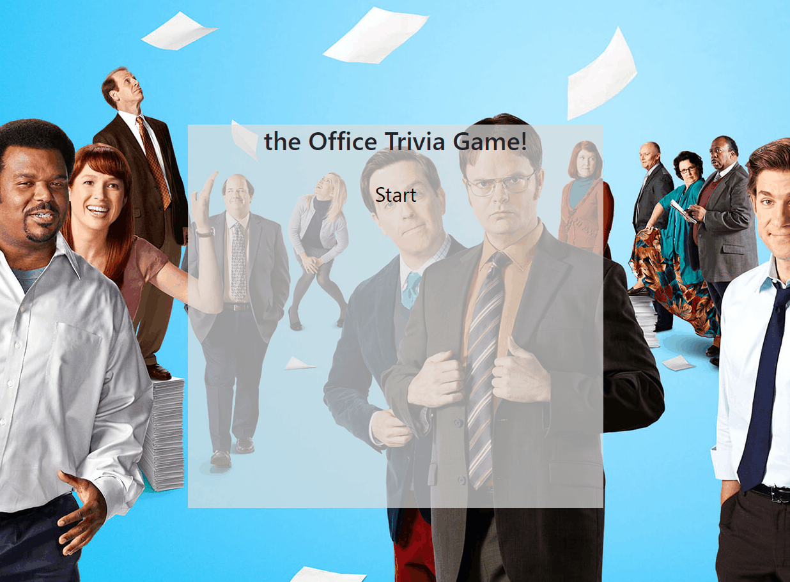

# TriviaGame

This is a trivia game that is built with jQuery. It dynamically popluates the buttons and questions on the screen
as depending on the question that is next. 

Game begins on user clicking the start button and the user has 20 seconds to select an answer. The game then goes to one of 3 screens depending on
whether they got the answer correct, wrong or didnt answer for 5 seconds before going to the next question. When the game is over it will display 
the number of correct answers and incorrect answers as well as a restart option.

Below are Gif's of the application running: 
<h3>Start of Apllication</h3>

<h3>Getting answer Correct</h3>

<h3>Getting Answer Wrong</h3>

<h3>No answer</h3>

<h3>End of Apllication</h3>

